# StreamVault — Licensed Streaming Subscription Website

A full front-end website for a licensed streaming subscription business: marketing site, blog with a lightweight CMS, contact system, and a plan-order pipeline — all built as static HTML/CSS/JS with a browser-storage backend (no server required to run it).

> ⚠️ **"StreamVault" is a placeholder brand name.** Swap it for your real brand name across all files before launch (see [Customizing](#customizing) below).

---

## 📸 Screenshots

> Screenshots below are placeholders — this environment couldn't render/screenshot the live pages. Open each file in a browser, take a screenshot, and drop it into the `screenshots/` folder with the filename shown. The README will pick them up automatically.

### Home page
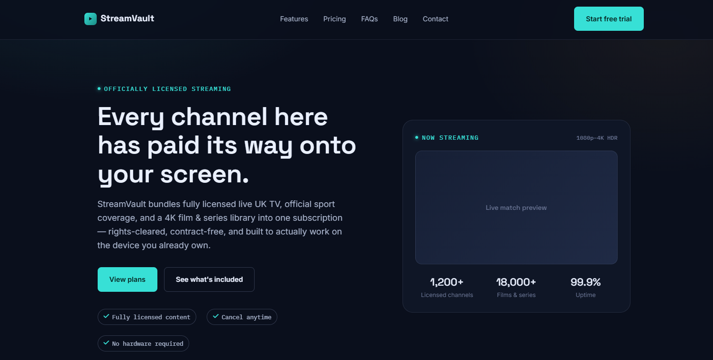
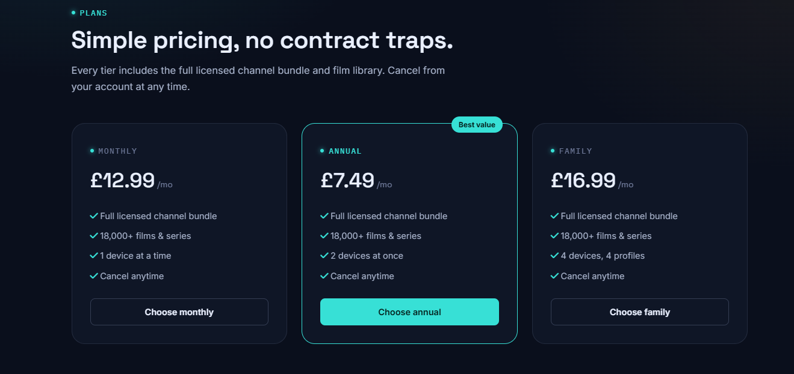
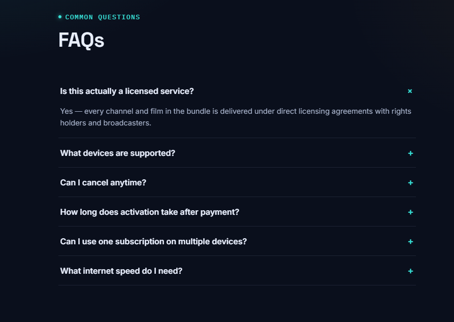

### Blog
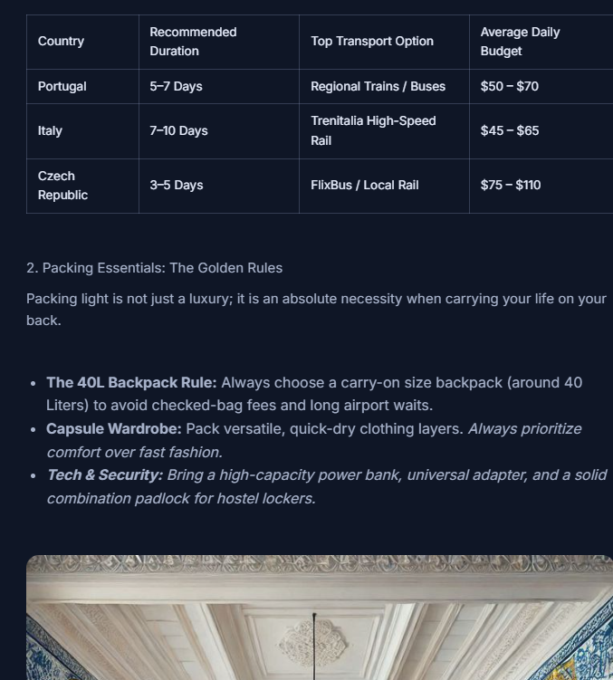


### Contact page
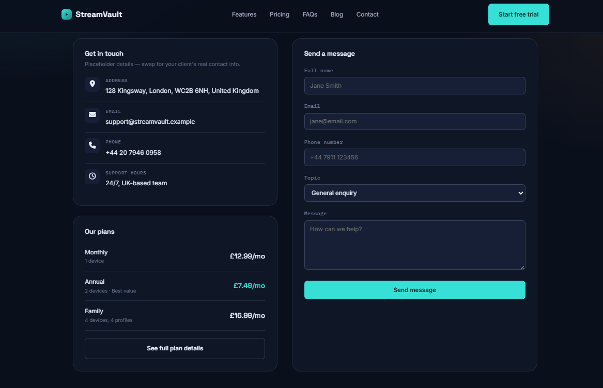

### Admin panel
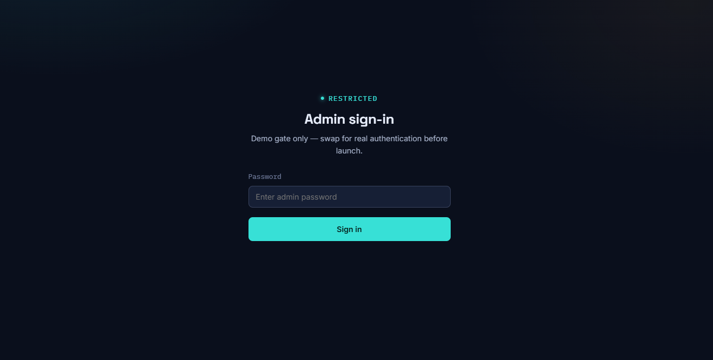
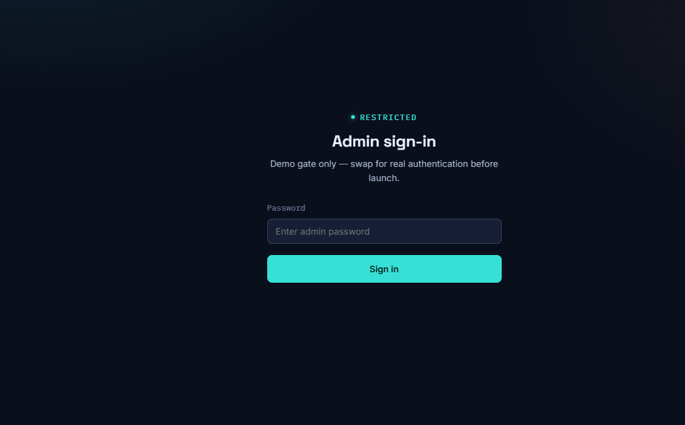
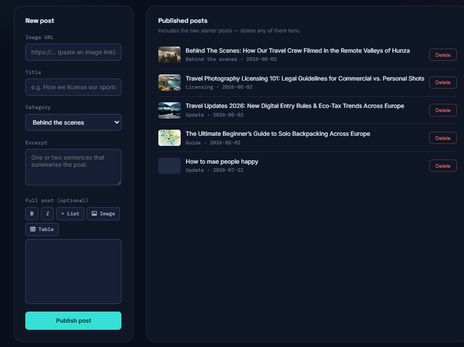
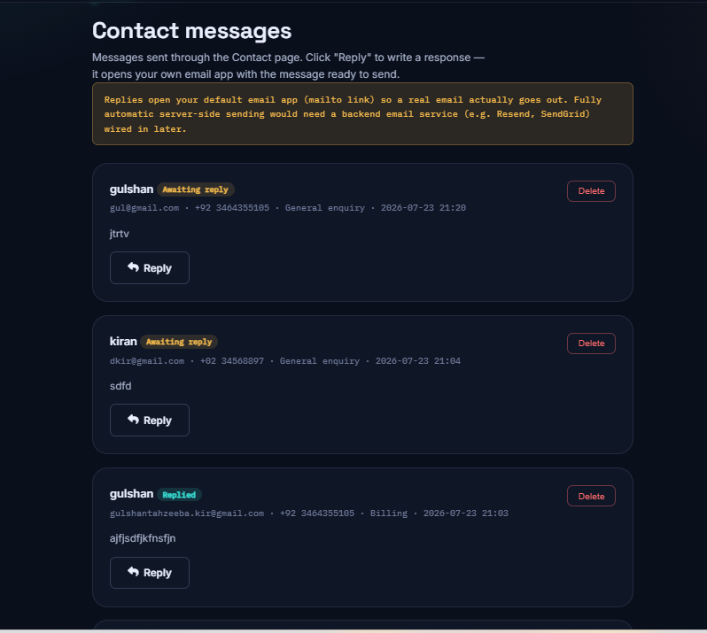


### Mobile view
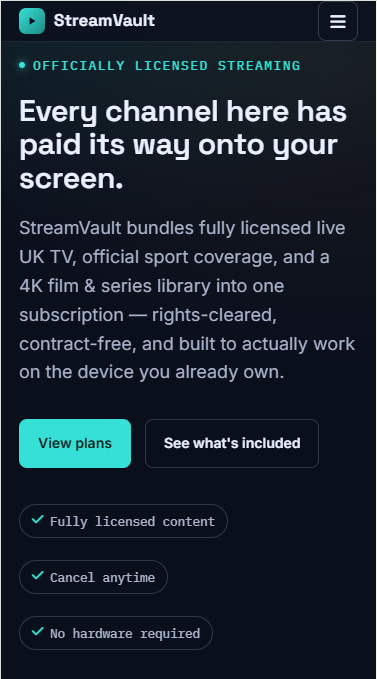
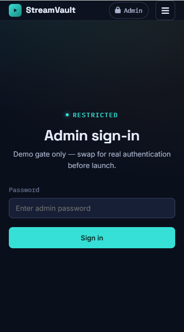
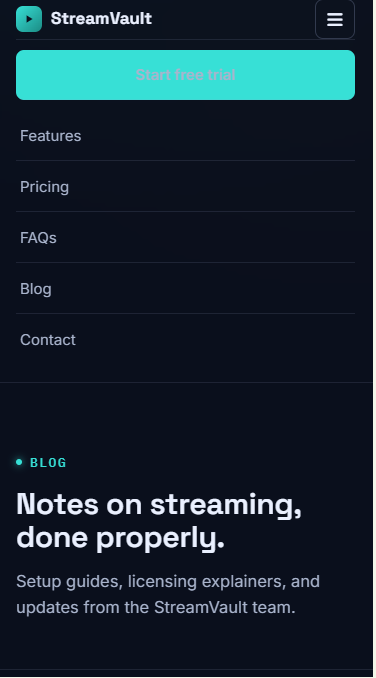
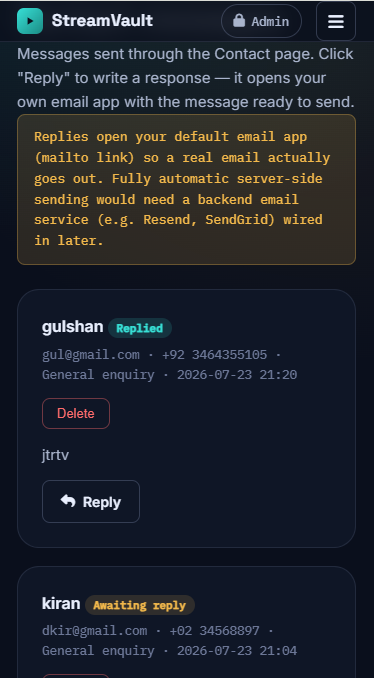


---

## ✨ Features

**Public site**
- Home page: hero, stats bar, live infrastructure status panel, feature grid, cable-vs-streaming comparison table, auto-scrolling supported-devices marquee, pricing plans, click-to-expand FAQ accordion
- Blog with rich post content (images, bullet lists, tables) — 3 posts per row, opens full post in a modal
- Contact page: address/email/phone, a validated contact form, mini plan summary
- Plan request flow: choosing a plan opens a lead-capture modal (name + email), followed by a "Pay now" placeholder step
- Fully responsive, including a hamburger menu on mobile

**Admin panel** (password-gated demo)
- `admin.html` — publish/edit/delete blog posts with a rich text editor (bold, italic, lists, image URL insert, table insert)
- `admin-contact.html` — view contact form submissions, reply via your own email app (mailto), or copy the reply text to paste into webmail
- `admin-plans.html` — view plan order requests, update status (Pending payment → Contacted → Paid → Cancelled)

**Validation**
- Email format is checked strictly, then verified against a real DNS lookup (Google's public DNS-over-HTTPS API) to confirm the domain can actually receive mail
- Phone numbers are checked for plausible format and rejected if obviously fake (e.g. all repeated digits)

---

## 🗂 File structure

```
streamvault-site/
├── index.html          Home page
├── blog.html            Blog listing + post modal
├── contact.html          Contact form + info
├── admin.html            Blog post admin
├── admin-contact.html    Contact message admin (reply via email)
├── admin-plans.html      Plan order admin
├── styles.css            Shared design system (colors, type, components)
├── blog-data.js           Blog post storage (localStorage)
├── site-data.js           Contact messages, plan orders, validation helpers
└── README.md              This file
```

All pages reference each other by relative path and share `styles.css`, so **keep every file in the same folder**.

---

## 🚀 Running it

No build step, no server needed:

1. Download/keep all files in one folder.
2. Open `index.html` directly in a browser — or, better, serve the folder locally so relative links and `fetch()` calls (used for email domain validation) work smoothly:
   ```bash
   # Python
   python3 -m http.server 8000
   # or Node
   npx serve .
   ```
3. Visit `http://localhost:8000`.

---

## 🔐 Admin access

- URL: `admin.html`, `admin-contact.html`, `admin-plans.html`
- Demo password: `admin123` (set in each file — search for `DEMO_PASSWORD`)

**This is a demo-only gate.** The password is visible in plain text in the page source and there's no real session or server-side check. Replace it with real authentication before this goes anywhere near real customers.

---

## ⚠️ Known limitations (read before going live)

This is a front-end-only build. A few things are intentionally *not* production-ready yet:

| Area | Current state | What's needed for production |
|---|---|---|
| **Data storage** | Browser `localStorage` (per-device, not shared) | A real database + backend API |
| **Payments** | "Pay now" shows a placeholder message | A real payment processor (Stripe, PayPal, etc.) with a proper backend — no raw card fields were built, on purpose, since collecting card data without a real, PCI-compliant processor is a security risk |
| **Email replies** | Opens your device's default email app via `mailto:` | A transactional email service (Resend, SendGrid, etc.) for one-click automatic sending |
| **Email/phone verification** | Format check + real domain/MX lookup (email only) | True verification needs a confirmation-email link or SMS OTP — both need a backend |
| **Admin login** | Hardcoded demo password | Real authentication (hashed passwords, sessions, or SSO) |

---

## 🎨 Customizing

- **Brand name/logo**: search for `StreamVault` across all files and replace.
- **Colors/fonts**: edit the CSS variables at the top of `styles.css` (`:root { ... }`).
- **Contact details**: edit the address/email/phone block in `contact.html`.
- **Pricing**: edit the plan cards in `index.html` (`#pricing` section) and `contact.html`.
- **Images**: blog post thumbnails default to placeholder images from picsum.photos — replace with real image URLs from the admin panel's "Image URL" field, or edit the seed data in `blog-data.js`.

---

## 🧱 Tech stack

Plain HTML/CSS/JS — no framework, no build tools. Fonts via Google Fonts (Space Grotesk, Inter, IBM Plex Mono), icons via Font Awesome (CDN).
